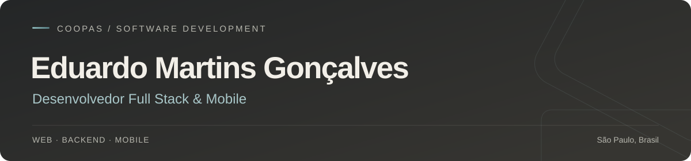

  

  <a href="https://www.linkedin.com/in/eduardomartinsdev/">LinkedIn</a>
  &nbsp; · &nbsp;
  <a href="https://github.com/coopas?tab=repositories">Repositórios</a>
  &nbsp; · &nbsp;
  <a href="https://iteams.felpstech.com">iTeams</a>

### Olá, sou o Eduardo.

Sou desenvolvedor na **FelpsTech**, onde construo e mantenho aplicações web e mobile. Trabalho principalmente com TypeScript e Flutter, passando pela interface, API, banco de dados e publicação.

Sou responsável pelo desenvolvimento do **iTeams**, uma plataforma de gestão de equipes com tarefas, projetos, chat e controle de tempo. É um dos trabalhos que melhor representa minha experiência em construir um produto e acompanhar sua evolução depois da entrega.

Também curso **Defesa Cibernética na FATEC Jundiaí**. No **SecurityHub**, junto desenvolvimento e segurança em uma aplicação para organizar vulnerabilidades e acompanhar suas correções.

### Tecnologias que uso

**Web** &nbsp; `TypeScript` `React` `Next.js` `Angular`  
**Backend** &nbsp; `Node.js` `Go` `Java` `Spring Boot`  
**Mobile** &nbsp; `Flutter` `Dart`  
**Dados e infraestrutura** &nbsp; `PostgreSQL` `Redis` `Docker` `AWS`

### Trabalhos em destaque

#### [iTeams ↗](https://iteams.felpstech.com)

Plataforma SaaS que reúne a organização do trabalho e a comunicação de equipes. Desenvolvo o cliente em Flutter e a API em TypeScript, incluindo permissões por organização, integrações, funcionalidades em tempo real, testes e publicação.

O código é fechado. No [case técnico](https://github.com/coopas/iteams-case-study), apresento o produto, a arquitetura e algumas decisões de engenharia.

`Flutter` `TypeScript` `Fastify` `PostgreSQL` `Redis` `Docker`

#### [SecurityHub ↗](https://github.com/coopas/SecurityHub)

Uma plataforma para reunir vulnerabilidades, distribuir responsáveis e acompanhar correções. Importa relatórios do Nmap, OWASP ZAP e Nuclei, com revisão dos resultados e identificação de duplicatas.

Desenvolvi o backend em Java com Spring Boot e a interface em Angular. O projeto inclui isolamento de dados por empresa, permissões por perfil, histórico de alterações e testes de integração com PostgreSQL real.

`Java` `Spring Boot` `Angular` `PostgreSQL` `Testcontainers` `Docker`

#### [Capycator ↗](https://github.com/coopas/capycator)

Um autenticador 2FA em Flutter, desenvolvido em parceria. Minha participação inclui as interfaces, a integração com a lógica do aplicativo e os fluxos de organização de contas, importação e exportação.

`Flutter` `Dart` `TOTP`

---

A maior parte do meu trabalho é feita em repositórios privados de empresas e clientes.
